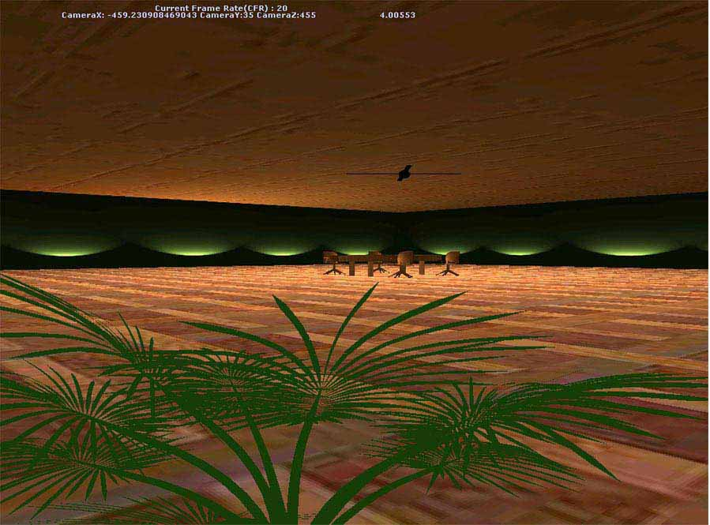



## RPG  3D\(Beggining\)

### Description

It's Supposed To be RPG Game In The Future ..

But Still The Collision Detection and Some Animation With A Good Graphics Design.. Anyway Try It Some Code Lines Could Be Useful .. Use The Arrows To move And Z,X To move on Y , and if u enabled the light then L,K,J,I to mive the Light

hmmm I Hope U Vote For it (I Had To Take Off The Graphics To Be Able To Upload It Here..!!!
 
### More Info
 

             |
---                |---
**Submitted On**   |2003-11-07 10:04:30
**By**             |[Hassan sameh](https://github.com/Planet-Source-Code/PSCIndex/blob/master/ByAuthor/hassan-sameh.md)
**Level**          |Beginner
**User Rating**    |4.0 (16 globes from 4 users)
**Compatibility**  |VB 6\.0
**Category**       |[DirectX](https://github.com/Planet-Source-Code/PSCIndex/blob/master/ByCategory/directx__1-44.md)
**World**          |[Visual Basic](https://github.com/Planet-Source-Code/PSCIndex/blob/master/ByWorld/visual-basic.md)
**Archive File**   |[RPG\_\_3D\(Be16721611152003\.zip](https://github.com/Planet-Source-Code/hassan-sameh-rpg-3d-beggining__1-49917/archive/master.zip)

